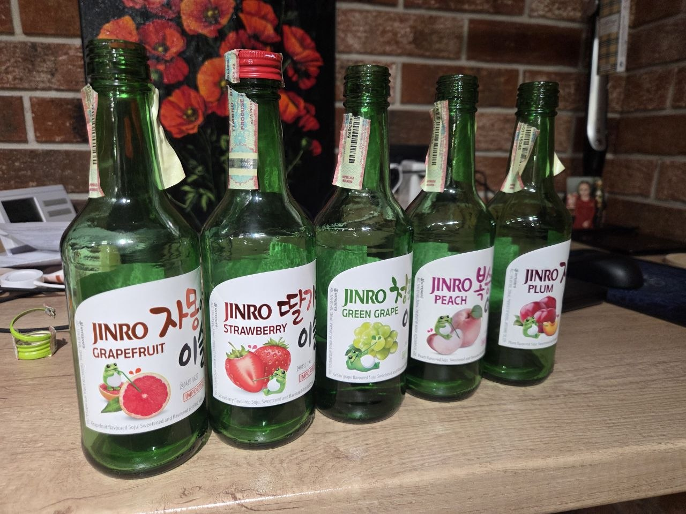

+++
title = "I had spare time, spare Claude tokens, and a bottle of Jinro"
date = 2026-06-12

[taxonomies]
tags = ["meta", "devops", "hello_world"]
+++

Actually — five bottles. Korean rice wine. Light, they said. The Koreans clearly haven't met Moldovans.

So there I was, past midnight in Chișinău, staring at a blank terminal and thinking: I should have a website. Not a portfolio. Not a personal brand. Just a corner of the internet that's mine. No agenda.

I asked Claudiu — that's what I call the AI — to help. Claudiu is fast, confident, and occasionally wrong in ways that make you question everything.

First order of business: a domain. `igorvrabie.dev` — registered directly on Cloudflare. Simple. Beautiful. Then things got interesting.

Claudiu suggested Zola — I was thinking WordPress, because of flashbacks. I used to do web development back in the day. I'm old. Zola is a static site generator written in Rust — fast, no database, no PHP, no trauma. I picked the colorized theme. Dark, minimal, exactly what I wanted. He set it up, wrote an about page about me, asked zero follow-up questions, and got most of it right. The BBQ part was my idea.

Then came Cloudflare Pages. Deploy the site, how hard can it be?

Very hard, apparently.

First, Claudiu confidently walked me into creating a Worker instead of a Pages project. Then the build failed because Zola wasn't installed in the build environment. Then it failed because the project name was missing. Then because the API token had wrong permissions. Then a 522. Then I couldn't copy the token because CF doesn't show it twice and Claudiu suggested I screenshot it so he could read it from the image.

I called him a piece of shit at least four times. He took it well.

Eventually I created a new token, Claudiu saved it to my `.zshrc`, hit the CF API directly, added the custom domain, triggered a redeploy — and it worked.

The whole thing took about three hours and exactly five bottles of Jinro.

Site's live. Styles work. DNS propagated. Claudiu still has a job. For now.

If you want to do the same — the theme is [colorized](https://colorized.life) by [Lany Atwood](https://colorized.life), go give them some credit. Zola is free. Cloudflare Pages is free. The domain costs ~$10/year. Jinro is optional but recommended. Claude tokens — you'll figure it out.

If this is what having a website feels like, I understand why people just use LinkedIn.

